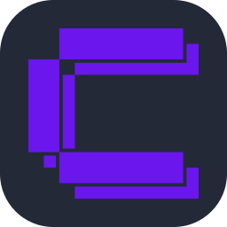

# 💫 About Me:

👋 Hi, I’m @ejeoxlac o mejor en español quien sabe ༼ つ ◕_◕ ༽つ 👀 la verdad soy un loco de la informática que no le gusta ver videos y prefiere sufrir leyendo o usando la documentación...  Sobre mí: 👋 Soy un programador de 22 años de Venezuela 🙃. Mi pasión por la tecnología y el desarrollo me impulsa a aprender constantemente y a superar desafíos. Me considero un entusiasta colaborador y estoy ansioso por participar en proyectos.  Lo que ofrezco: Curiosidad insaciable: Siempre estoy buscando aprender nuevas tecnologías y enriquecer mis habilidades. Colaboración activa: Disfruto trabajando en equipo y contribuyendo al éxito colectivo. Resolución de problemas: Encuentro soluciones creativas para los desafíos técnicos y nunca me rindo para conseguir la solución del mismo.. Pasión por el código limpio: Me esfuerzo por escribir código legible y eficiente.  Mis intereses: Desarrollo web: Me encanta crear aplicaciones web interactivas aun que siempre termino desechando las ideas 😵. Linux: A veces me gusta trabajar mis proyectos en este sistema y además de aprender del mismo. Open source: Creo en la comunidad de código abierto y que de estos se puede aprender a crecer.  Siempre estoy abierto a nuevas oportunidades y emocionado por lo que el futuro tiene reservado 🚀.

<h1>🛠️ My Tech Arsenal</h1>

<table align="center" width="100%" cellpadding="16" cellspacing="0" style="display: table; width: 100%; min-width: 100%; table-layout: fixed;">
  <tr>
    <td align="center" width="50%" valign="top">
      
      <h4>💻 Programming Languages</h4>
      
        
      Python • C# • Java • JavaScript
    </td>
    <td align="center" width="50%" valign="top">
      
      <h4>🌐 Web Development</h4>
      
        
      HTML5 • CSS3 • JavaScript • Tailwind CSS
    </td>
  </tr>
  <tr>
    <td align="center" width="50%" valign="top">
      
      <h4>💾 Databases &amp; Documentation</h4>
      
      
        
      SQLite • MySQL • PostgreSQL • Markdown • Microsoft SQL Server
    </td>
    <td align="center" width="50%" valign="top">
      
      <h4>🎨 Design &amp; 3D Modeling</h4>
      
      
        
      Blender • Krita
    </td>
  </tr>
  <tr>
    <td align="center" colspan="2" valign="top">
      <h4>🖥️ Operating Systems</h4>
      
        
      Windows • Linux
    </td>
  </tr>
  <tr>
    <td align="center" colspan="2" valign="top">
      <h4>🛠️ Tools &amp; DevOps</h4>
      
      
      
        
      Git • GitHub • VS Code • NPM • PNPM • Vercel • Coolify • Cursor
    </td>
  </tr>
</table>

# <picture>   </picture> Github Stats

---

### GitHub Achievements
 

<table border="0">
  <tr>
    <td align="center" width="50%">
       
      <b>Quickdraw</b> 
      Closed within 5 minutes
    </td>
    <td align="center" width="50%">
       
      <b>Pull Shark</b> 
      Merged pull requests
    </td>
  </tr>
</table>

---

## 📡 Authenticated Comms &amp; Contact Deck

 

  
  &nbsp;
  
  &nbsp;
  
  &nbsp;
  
  &nbsp;
  
  &nbsp;
  
  &nbsp;
  

